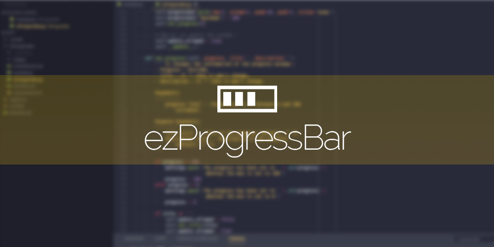

# EzProgressBar 
It allows you to create and update a progress bar in a very simple way.
It is made to be used in a non-object oriented programming context. You
won't have to handle threads or anything.

This API is built over the [tkinter](http://tkinter.fdex.eu/) lib. 

## How to use it
It is a simple as this :

- Import it
```python
from EzProgressBar import EzProgressBar
```

- Create the window
```python
progress_window = EzProgressBar('My progressbar window',
                                'Sleeping',
                                'still sleeping')
```

- Update the progression at any time :
```python
progress_window.set_progress(10)
```

- Close the window once it's done :
```python
progress_window.close()
```

## What does it look like ?


You can change the title or the description in the same time as the progression with:

```python
progress_window.set_progress({progression},
                             title={title},
                             description={description})
```

Or one by one with:
```python
progress_window.set_title({title})
progress_window.set_description({description})
```

You can change the icon too with:
```python
progress_window.set_icon({icon path})
```

Or directly when creating the window with:
```python
progress_window = EzProgressBar({window title},
                                {progress title},
                                {progress description},
                                icon={icon path})
```

## How to use it in your projects

Get the file from the github page and put it in your project directory.

## Documentation

The detailed documentation is available on the [wiki](https://github.com/N3ROO/EzAPI/wiki).

## Contributing

If you want to contribute, make sure to respect PEP8 and python coding conventions. And please remind that the goal of this API is to be very easy to use in a non-object oriented programming context.

## Misc

- See the changelog [here](CHANGELOG.md),
- See the licence [here](../LICENSE).