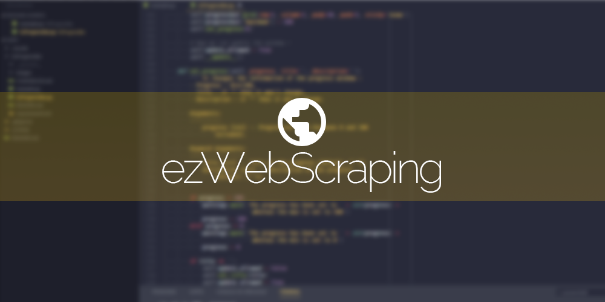

# EzWebScraping 

A simple way to retrieve data from websites that requiere login.

## How to use it

> todo

## How to use it in your projects

> todo

## Documentation

The documentation will soon be available on [n3roo.github.io](https://n3roo.github.io/).

## Contributing

If you want to contribute, make sure to respect PEP8 and python coding conventions. And please remind that the goal of this API is to be very easy to use in a non-object oriented programming context.

## Misc

- See the changelog [here](CHANGELOG.md),
- See the licence [here](../LICENSE).