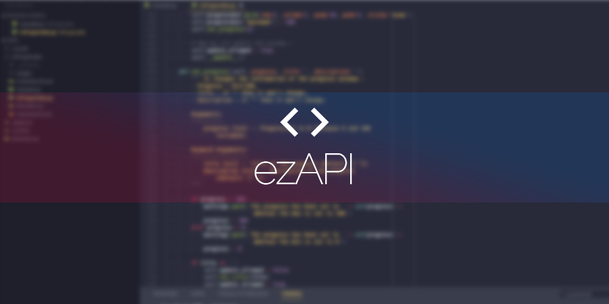

# EzAPI
  

A compilation of useful and VERY simple python APIs maintained by N3ROO. Those are made to be used in a non-object oriented programming context and can be used by beginners to do complex things in an easy way.

## Index
- [EzProgressBar](EzProgressBar/README.md) : A simple way to display a progress bar while running code without threads or anything,
- [EzWebScraping](EzWebScraping/README.md) : A simple way to retrieve data from websites that requiere login.

## How to use it

Simply get the .py file you want from github and put in in your project. Make sure that you have the libs requiered (check the requirements.txt file). It is working with python 3.6 and above. It could be working for older versions, but I haven't tried.

## Documentation

All the documentation, and the illustrated tutorials are availaible on the [github wiki](https://github.com/N3ROO/EzAPI/wiki).

## Misc

- Licence : [MIT Licence](LICENSE)
- Contributing : See the README of the project on which you want to contribute
